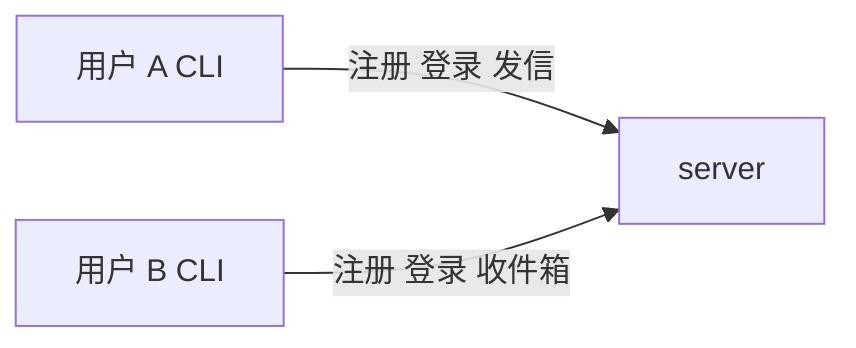

# 智能安全邮箱 — P0 需求范围

## 1. 文档目的

在《智能安全邮箱设计》全量题目下，**P0 只跑通一条最小可运行链路**：**注册 → 登录 → 发信 → 收信（读信）**。客户端形态为可独立启动的 **CLI `client`**（子命令或交互式菜单均可）。

---

## 2. P0 功能列表（精简）

| 优先级 | 功能 | 说明 |
|--------|------|------|
| **P0-1** | 服务端：接收请求 | 单 `server` 进程，能接收客户端业务请求（传输方式自洽即可：HTTP / gRPC / 自建协议等）。 |
| **P0-1** | 服务端：持久化存储 | 用户与邮件数据落盘，**进程重启后可恢复**；单实例、单逻辑域即可。 |
| **P0-2** | 注册 | 创建账号（至少用户名 + 密码；可与确认密码一并采集）。 |
| **P0-2** | 登录 | 已注册用户凭凭证登录，后续可发信、收信。 |
| **P0-3** | 发信 | 指定收件人、主题、正文（纯文本即可）；服务端落库，**本系统内收件人**可在收件箱看到。 |
| **P0-3** | 收信 | 收件箱列出当前用户收到的邮件，并能在终端**查看单封正文**（列表 + 读信）。 |

**优先级含义**：P0-1 为基础设施（无则无闭环）；P0-2 为账号链路；P0-3 为邮件读写。同号内无先后依赖时可并行实现。

**P0 核心闭环判据**：用户 A 注册/登录后向用户 B 发信；用户 B 注册/登录后在收件箱看到并读完该邮件；可重复执行且结果一致。

---

## 3. 明确不做（非 P0）

以下内容 **不纳入 P0**，留待后续迭代：

- **双 server / 双域名**：两实例并行、跨域互发、存储目录跨实例隔离。
- **客户端**：发件箱、草稿箱、群发、群组、快捷回复、附件、撤回、快捷操作、任何算法/智能能力。
- **题目「安全与稳定性」专章交付**：防爆破、限流、钓鱼识别、威胁模型文档、可复现安全测试等——P0 **不作为交付项**；实现注册/登录时仅按常识处理密码与鉴权即可。
- **题目测试与验收中的扩展项**：并发压测、钓鱼样例、附件与去重存储等——**非 P0**。
- **加分项**：恶意脚本 POC、E2E 加密专章、审计告警、P2P 等。

---

## 4. P0 验收标准（最短）

1. 一个 `server` 可启动，具备 **接收 + 持久化**，重启后数据仍在。  
2. CLI `client` 可完成 **注册、登录、发信、收件箱（收信/读信）**。  
3. 至少两名本机用户完成「A 发 → B 收并读」。  
4. 提供可复现的启动方式与最短操作说明（脚本可选）。

---

## 5. 与全量题目的关系

| 全量模块 | 相对 P0 |
|----------|---------|
| 双域两 server、互发 | 后续 |
| 发件箱、附件、智能、安全专章与扩展测试 | 后续 |

---

## 6. 修订记录

| 版本 | 说明 |
|------|------|
| v0.1 | 初版：单核心闭环 + 最小安全 + 双域互通 |
| v0.2 | 明确客户端形态为 CLI |
| v0.3 | 收窄：单实例闭环；安全与双域等后置 |
| v0.4 | 按「注册/登录/发信/收信」收敛；增加功能优先级与「明确不做」分层 |
